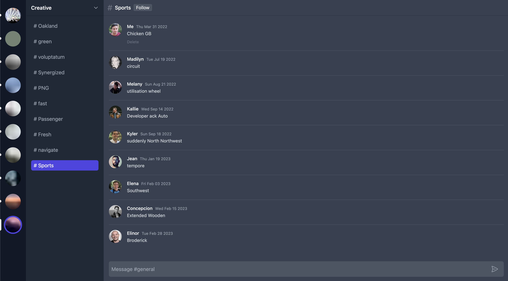

# Discord Clone



## Overview

This project is a simple clone of discord using multiple technologies. The project is separated between a front-end React app and a back-end go server (coming soon). When opening the demo for the first time, choose a server, followed by a topic.

  ### **Front-end:**
  The front-end is for demo purposes only. It does not currently have a live database. When first loading the app, a seed script will fire and populate your indexDB with fake data. You will also be assigned a random userId and photo. The front-end
  - React
  - Tailwindcss
  - Framer Motion
  - Zustand
  - Radix UI
  - Dexie

### **Back-end:**
The back-end is a work in progress. It will eventually be used to establish a websocket connection with the frontend.
- Go 

## Running Locally
To get the project running locally, first clone the repo and run the following commands:
1. Navigate to the client directory and install the dependencies:
   
   ```zsh
   cd client && yarn 
   ```
2. Start the dev server
   
    ```zsh
    yarn dev
    ```
  